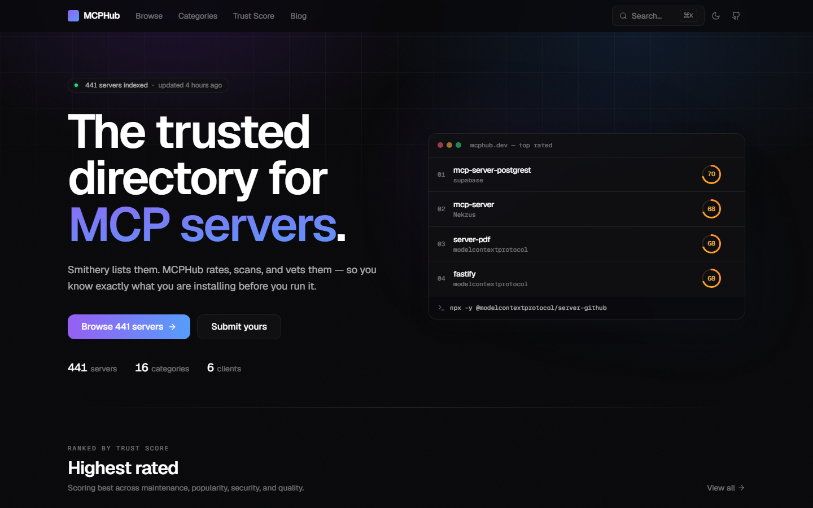
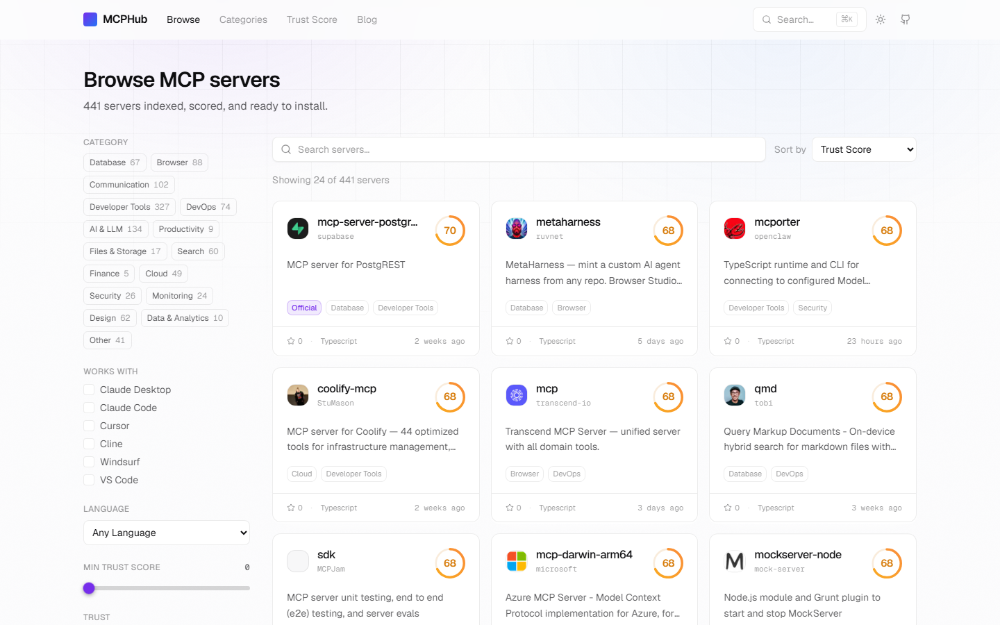
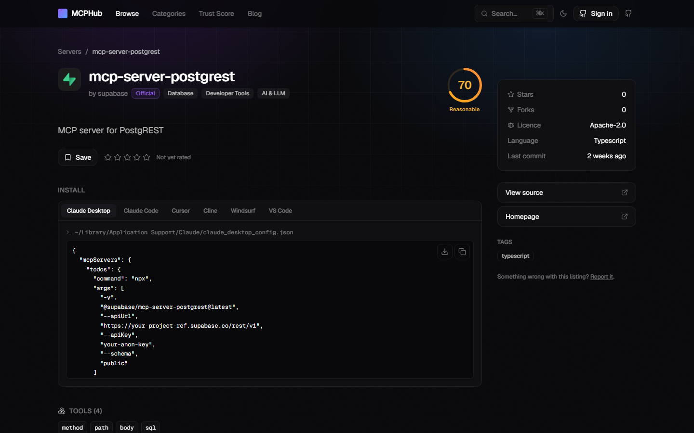
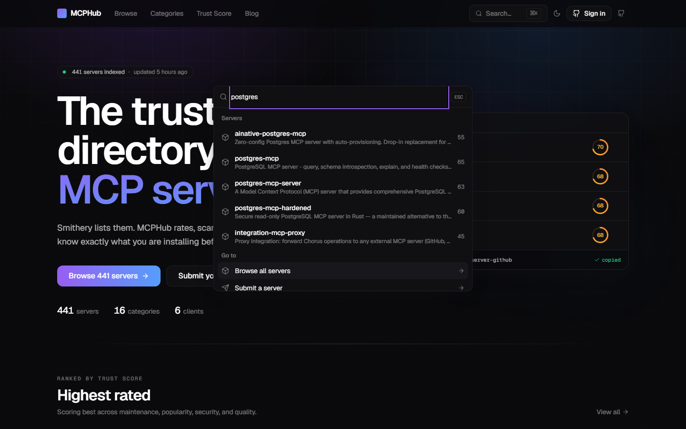

<div align="center">

# MCPHub

**The trusted directory for MCP servers.**

Smithery lists them. MCPHub rates, scans, and vets them.

[](https://github.com/parthksingh1/MCPHub/actions/workflows/ci.yml)
[](./LICENSE)
[](https://github.com/parthksingh1/MCPHub/stargazers)
[](./CONTRIBUTING.md)
[](#architecture)

</div>

---

MCPHub indexes, scores, and security-scans Model Context Protocol servers, so
you can find one and install it into Claude Desktop, Claude Code, Cursor,
Cline, Windsurf, or VS Code with a single copied command — and know what you
are running first.

## Screenshots

<div align="center">

|                                                |                                                         |
| ---------------------------------------------- | ------------------------------------------------------- |
|       |           |
| **Home** — live counts, no hard-coded numbers  | **Browse** — URL-synced filters, light mode             |
|   |  |
| **Server detail** — install command per client | **⌘K palette** — Postgres full-text search              |

</div>

Every screenshot is captured from real indexed data by
[`e2e/screenshots.spec.ts`](./apps/web/e2e/screenshots.spec.ts) — run
`pnpm --filter @mcphub/web screenshots` to regenerate them. Both themes are
captured; see [`docs/screenshots/`](./docs/screenshots) for all fourteen.

## Why it exists

An MCP server runs on your machine, with your permissions, acting on
instructions that may ultimately come from text a model read somewhere. Other
directories tell you a server exists. MCPHub tells you whether it is
maintained, whether anyone uses it, what a security scanner found in it, and
whether it looks carefully built — as one number you can sort by.

## Features

- 🔎 **Full-text search** across every indexed server, with a ⌘K palette
- 🛡️ **Weekly security scans** using a purpose-written Semgrep ruleset for
  MCP-specific risks — command injection from tool arguments, path traversal,
  hardcoded credentials, permissive CORS
- 📊 **Trust Score** — 0–100 from four transparent, open-source components
- ⚡ **One-click install** — the exact command for each of six MCP clients,
  plus a downloadable config file
- 🛡️ **MCPHub badges** — servers earn _MCPHub Trusted_, _Security clean_, _Top rated_ and more from published, tested rules; nothing can be bought
- 🏷️ **Embeddable README badges** — `?type=trusted` shows the Trusted badge once earned; three styles and a snippet builder at `/badges`
- 🗂️ **Collections** — curated stacks for common jobs (coding agents, DevOps, databases…), filled live with the top-scoring servers
- 🔌 **Public API** — everything the site uses, documented and open
- 🌓 **Dark and light** — full parity, not an afterthought

## Quick start

```bash
git clone https://github.com/parthksingh1/MCPHub.git
cd MCPHub
pnpm install
cp .env.example .env     # fill in Supabase + Upstash
docker compose up -d     # local Postgres 15 + Redis + Upstash REST emulator
pnpm db:migrate
pnpm dev
```

Open <http://localhost:3000>. Health probe: `/api/health`.

Seed it with real data — no GitHub token needed, the npm registry is
unmetered:

```bash
cd workers && pnpm crawl:npm
```

## How the Trust Score works

Four equally weighted components, 25 points each:

| Component       | Measures                                                                  |
| --------------- | ------------------------------------------------------------------------- |
| **Maintenance** | Commit and release recency; stale repos with issue backlogs are penalised |
| **Popularity**  | Stars on a log scale, official-vendor bonus, npm downloads                |
| **Security**    | Starts at 25; reduced per scanner finding and dependency advisory         |
| **Quality**     | README, licence, types, tests, CI                                         |

The algorithm is pure, deterministic, and covered by tests at 100% of
statements, branches, functions, and lines. Read it in
[`packages/scoring`](./packages/scoring), or the plain-English version at
[`/trust-score`](./apps/web/app/trust-score/page.tsx) — including a section on what
the score deliberately does not tell you.

## Repository layout

| Path               | What lives there                                       |
| ------------------ | ------------------------------------------------------ |
| `apps/web`         | Next.js 15 app — pages, Route Handlers, Server Actions |
| `packages/db`      | Drizzle schema, migrations, connection factory         |
| `packages/shared`  | Zod schemas, shared types, constants                   |
| `packages/scoring` | Trust Score algorithm — pure and fully unit-tested     |
| `packages/crawler` | Discovery, enrichment, README parsing, classification  |
| `workers/`         | Scripts run on GitHub Actions cron schedules           |
| `semgrep-rules/`   | The MCP security ruleset                               |
| `supabase/`        | SQL migrations, RLS policies, local bootstrap          |

## Scripts

| Command                            | Description                                     |
| ---------------------------------- | ----------------------------------------------- |
| `pnpm dev`                         | Start the dev server (respects `PORT`)          |
| `pnpm build`                       | Build every workspace package                   |
| `pnpm lint` / `typecheck` / `test` | What CI runs                                    |
| `pnpm db:migrate`                  | Apply migrations                                |
| `pnpm db:studio`                   | Open Drizzle Studio                             |
| `cd workers && pnpm crawl`         | Discover servers via GitHub, npm, awesome-lists |
| `cd workers && pnpm crawl:npm`     | npm-only discovery (no GitHub token needed)     |
| `cd workers && pnpm scan`          | Run the security scan                           |

## Architecture

One Next.js app, not a separate API. Route Handlers are the API; Server Actions
handle mutations. Four caching layers stack in front of Postgres — Cloudflare,
Vercel's edge cache, a Redis read-through cache with stale-while-revalidate and
stampede protection, and ISR on every page. Authorisation is Postgres RLS
rather than checks in route handlers, so a forgotten check cannot leak data.

Background work runs on GitHub Actions cron schedules. There is no always-on
server anywhere in the stack, which is what makes $0/month achievable.

## Self-hosting

Everything runs on free tiers: Supabase (Postgres + auth), Upstash (Redis),
Vercel (web), GitHub Actions (crawl, scan, refresh), and Cloudflare (DNS).
Copy `.env.example` to `.env`, fill in each service's keys, run the database
migrations, then deploy `apps/web` to Vercel and add the same variables as
GitHub Actions secrets for the workers.

## Roadmap

- [x] Monorepo, design system, database schema with RLS
- [x] Crawler: GitHub, npm, PyPI, awesome-lists
- [x] Trust Score with 100% test coverage
- [x] MCP-specific Semgrep ruleset
- [x] Public API, caching, and rate limiting
- [x] Browse, detail, category, compare, and submit pages
- [x] Embeddable Trust Score badges
- [x] SEO: sitemap, JSON-LD, per-category landing pages
- [x] Playwright E2E across the five critical flows
- [ ] `npx mcphub` CLI
- [ ] Weekly digest email
- [ ] Auto-generated `awesome-mcp` repository
- [ ] Security alerts RSS feed
- [ ] Realtime "just indexed" ticker

## Contributing

PRs welcome — see [CONTRIBUTING.md](./CONTRIBUTING.md). You do not need to
write code to help: submit a missing server at `/submit`, or open an issue if
you think a Trust Score weight is wrong.

## Licence

[MIT](./LICENSE) © Parth Kumar Singh

Maintained by [@parthksingh1](https://github.com/parthksingh1/MCPHub).
